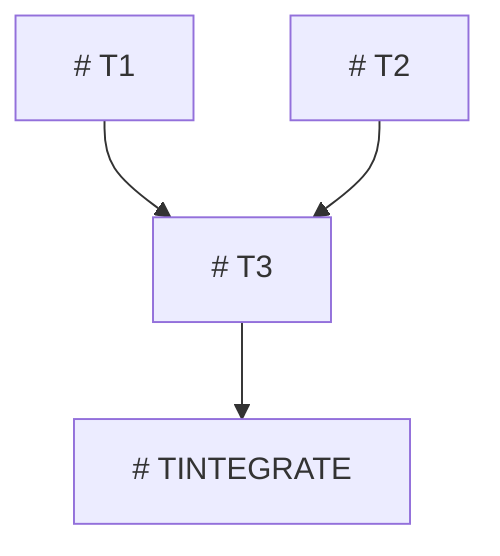

## Improvement Principle

Use root-cause analysis and root-cause fixes, not symptom patches. Generalize as principle-based guidance or design principles; avoid spec/case overfitting and special-casing unless evidence proves a bounded exception reduces user effort, maintainer effort, maintenance risk, or safety burden.
# Parallel Ticket Planner

Trigger / 트리거: parallel-ticket-planner, /병행티켓, 병행티켓, /parallel-ticket, 병렬 티켓, 동시 작업, ticket decomposition, conflict-aware tickets, coordinator cleanup prompt.

> 안전 노트: 두 에이전트 프로필이 함께 쓰는 **도구 비종속** 단일 소스. "코디네이터
> (coordinator) 세션" = 채택/머지를 책임지는 lead 세션. "워커(worker) 세션" = 한
> 티켓을 끝까지 처리하는 독립 세션. peer/recursive AI 호출, MoA, 다른 CLI 브리지 호출
> 금지. 같은 도구가 자기 서브에이전트로 이 레포 일을 하는 in-harness fan-out은 그
> 도구가 동시성 상한을 보장할 때만 허용.

## 병렬화 메커니즘 선택 (Which parallelism mechanism)

병렬 lane을 어디서 돌리느냐로 메커니즘을 고른다.

- **In-harness 네이티브 fan-out이 가능한 도구면 1순위로 쓴다.** 외부 런처 없이
  서브에이전트 오케스트레이션·격리·동시성 상한을 도구가 관리한다. 도구가 이 기능을
  제공하지 않으면(single-AI-per-session 프로필 등) 건너뛴다.
- **이 스킬의 paste-ready 프롬프트는 SEPARATE 창/세션용, 또는 사람이 직접 lane을 돌릴
  때용이다.** 한 harness fan-out으로 안 될 때(관리자가 창 여러 개, 또는 사람이 lane마다
  직접 운전) 쓴다.
- **새 파일을 만드는 lane은 worktree를 쓰지 않는다 (load-bearing).** worktree에서 만든
  새 파일은 메인 체크아웃으로 모이지 않아 소실된다(worktree-collection-gap). 새 파일
  lane은 **disjoint 파일 경로**(충돌 매트릭스)로만 격리: 각 lane은 공유 체크아웃 안에서
  자기 non-overlapping 경로만 쓰고, 코디네이터가 lane별 경로를 따로 커밋한다. worktree는
  병렬 lane들이 **같은 기존 파일**을 편집할 때만 돕는다. lane이 공유 파일 편집과 새 파일
  생성을 둘 다 하면 쪼개거나 직렬화한다.
- **거대 병렬 셸 배치로 fan-out을 흉내내지 않는다.** 한 응답에 10개+ 병렬 셸 호출 몰아넣기
  금지: 한 호출 에러 시 배치 전체 취소(`Cancelled: parallel tool call ... errored`), 긴
  세션에선 큰 배치가 도구 I/O를 깨뜨린다. GitHub/git mutation(push/merge/PR)과 chained
  호출(뒤 인자가 앞 결과에 의존)은 순차로 돌린다. fan-out은 동시성 상한을 보장하는
  네이티브 경로에만 맡긴다.

Turn remaining work into a top-to-bottom guide for a non-developer manager: open
sessions, paste prompts, wait for signals, know when the coordinator session must
review and adopt. 산출물은 backlog가 아니라:

```text
analysis sections -> phase guide -> one paste-ready prompt per ticket -> coordinator adoption order -> safety common
```

코디네이터가 오케스트레이션을 직접 하는 모드(예: overnight all-tickets)에서는 관리자 경로가 다르다:

```text
관리자는 코디네이터 세션 하나만 실행한다.
코디네이터가 워커 시작, retry, 채택, 다음 wave, 검증,
PR/merge/issue/Project 게이트, 최종 보고를 맡는다.
워커 프롬프트는 fallback 산출물이자 복구 핸들이지, 관리자 잡무가 아니다.
```

이 모드에서도 의존/충돌 분석과 워커 프롬프트 생성은 유지하되, 워커 프롬프트를 관리자
paste 큐로 제시하지 않는다. 코디네이터가 이 환경에서 워커/서브에이전트를 자동으로 띄울
수 없다고 증거와 함께 보고할 때만, 워커 프롬프트를 수동 복구용 fallback으로 표시한다.

### Coordinator Cleanup Is Mandatory (not "if needed")

병렬 계획은 코디네이터 cleanup/adoption lane 없이는 미완. 이 lane은 모든 워커 wave 뒤,
최종 보고나 다음 wave **전에** 돈다. 반복 실패는 분해가 나빠서가 아니라 코디네이터가
under-adopt 해서다: 열린 PR, 미머지 draft, 낡은 claim, reopened issue, priority-core lane이
남았는데 보고는 "done"으로 읽힌다. 그래서:

- **어떤 lane이 PR, issue comment, data artifact, `REVIEW_READY`, 또는 blocked lane을
  만들 수 있으면, `TCLEANUP` 코디네이터 cleanup 프롬프트가 다음 phase나 최종 보고 전에
  MANDATORY다.** prose로만 묻지 말고 자기 paste-ready 프롬프트로 emit한다(섹션 7).
- **Cleanup inventory는 명백한 열린 PR/issue 외에도 포함:** run 보고에 언급된 열린 issue;
  머지된 PR에서 링크된 열린 issue; 이번 run inventory에서 priority/core/top 라벨 열린 issue;
  cleanup 중 새로 REOPENED 된 issue(다시 inventory로); claim이 blocked에서
  `OWNERSHIP_CLEAR_TO_START`로 바뀐 lane(runnable-now로 재분류); 이번 run ledger는 있지만
  close/adoption은 없는 issue.
- **"Future ticket flow"는 cleanup 결과가 아니다.** agent-owned current-run 작업을 "normal
  future ticket flow" / "next overnight" / 후속 / 보류 / 나중으로 미루지 않는다. 다음 phase를
  시작하거나, 코디네이터 continuation 프롬프트를 출력하거나, manager-only / hard-external /
  승인된 out-of-scope임을 증명한다. 아니면 cleanup은 성공이 아니라 `TCLEANUP_NOT_DONE` 또는
  `NEXT_PHASE_REQUIRED`로 끝난다.

## Infinite mode + audit (when planning a long autonomous run)

사용자가 "keep going / run everything overnight / until done"를 요청하면 계획은 one-shot이
아니라 loop-shaped여야 한다:

- **No stop-to-ask between tickets.** 각 lane이 끝나면 다음이 즉시 시작; 진짜 human-only
  gate(product/priority, credentials, money, public release, destructive/irreversible,
  host-global, user data, force-push/history rewrite)만 멈춘다. 나머지는 판단하고 계속.
- **The loop does not restart itself.** 대화 turn은 끝나면 idle이 되므로 run을 구조로 만든다:
  workflow/orchestration 도구와/또는 scheduled re-trigger로 cycle을 돌리고, cycle마다 resume
  note + next ticket을 남겨 fresh 세션이 멈춘 지점에서 정확히 이어가게 한다.
- **별도 주기적 audit lane(~15분)을 계획한다** — feature 작업 안 함: goal+rules 재독, 최근
  lane이 mission에 부합하는지·모든 done/PASS에 진짜 command/gate 증거가 있는지 확인
  (auto-compaction drift와 낙관적 보고를 잡는다), main이 clean하고 매달린 PR 없음을 확인,
  drift를 되돌리고, 정상이면 one-line OK 로그.
- **Both tools, when shared.** shared 개선은 한 번 계획(one edit → both profiles,
  mirror-parity-enforced); tool-specific lane은 맞는 프로필에(Claude workflow/ultracode vs Codex goal).

## Runtime Boundary

관리자 친화 계획 가치만 유지. 활성 authority는 코디네이터 세션:

- 코디네이터 세션이 분해, 증거 검토, 종합, 최종 mutation 채택, GitHub PR/merge 결정,
  issue/Project 완료를 소유한다.
- 워커는 이 레포 일을 하는 독립 세션, 서브에이전트, 또는 worktree lane. peer/recursive AI
  호출이나 다른 CLI 브리지 명령 금지.
- 워커 출력은 blocked가 아니면 `REVIEW_READY`에서 끝난다. 최종 merge, issue closure,
  Project 완료를 주장하지 않는다.
- Lightweight/low-effort worker output is evidence only for high-judgment
  decisions. Architecture, security/credential boundaries, external adoption,
  release/merge readiness, public-safe propagation, irreversible actions, and
  any decision requiring both current-system and target-system understanding
  must be adopted by the coordinator through high-quality synthesis with
  `Observed locally`, `Observed upstream`, `Inferred`, and `UNVERIFIED`
  boundaries.
- 기존 파일을 편집하는 patch 작업은 격리 worktree(`<runtime>/worktrees/<task-id>`)를 쓴다
  (활성 레포 규칙이 더 엄격한 경로를 지정하지 않는 한). **예외(load-bearing):** 새 파일을
  CREATE 하는 lane은 worktree를 쓰지 않는다(disjoint 경로로 격리 — 위 "병렬화 메커니즘 선택"
  참조).
- host-global 에이전트 프로필, credentials, 환경 비밀 파일, SSH 자료, 브라우저 프로필, auth
  상태, secrets 디렉터리를 읽거나 쓰지 않는다(canonical set: `schemas/forbidden-paths.json`).
- host helper 스크립트를 import 하지 않는다. 레포 안 `scripts/*.ps1`, `gh`, plain `git`을 쓴다.

## Native Dispatch Mode

Use this mode when the current tool exposes thread/session/worktree creation and
the user has authorized the coordinator to manage sessions.

- Do not stop at paste-ready prompts if the tool can create project-scoped
  workers directly. Create or propose worker sessions with clear titles, roles,
  owner surfaces, stop signals, and coordinator/guardian ids.
- Verify every worker after creation: title, `cwd`, branch/worktree, owner
  surfaces, and stop signal must match the plan.
- Attach one guardian/heartbeat/audit lane to the coordinator, not to stale
  workers. Copied hashes and counts in prompts are stale hints until verified.
- Wrong-workspace, duplicate, or stale workers are stopped/checkpointed and
  renamed or archived according to the tool profile after the replacement
  mapping is verified.
- Worker closeout is not success merely because tests ran. Useful changes must
  end in a draft PR, `REVIEW_READY` packet, explicit blocker evidence, or
  no-change evidence. Idle/completed plus uncommitted changes is early stop.
- Final plan/report includes `active_goal`, `active_guardian`, `workers`,
  `cleanup_gate`, `split_gate`, and stale-worker cleanup status when the tool can
  expose these fields.
- User interaction is intentionally narrow: do not present worker prompts as the
  normal path when the coordinator can launch workers. Show prompts only as
  fallback/recovery artifacts, and keep the user-facing instruction to one safe
  action or one meaning-level decision.

## Source Lessons To Preserve

`병행티켓` value = 비개발자 관리자가 운용 가능한 병렬 작업. Preserve:

- 한 세션은 한 티켓만 처리한다.
- 모든 구현 티켓은 전용 worktree와 branch를 쓴다(새 파일 생성 lane은 손실을 막으려 메인
  체크아웃을 쓴다).
- 레포에 세션 claim 헬퍼 스크립트가 있으면 모든 구현 티켓이 편집 전 레포 안 세션 claim을
  잡는다. 같은 issue/branch/worktree/owner-surface 겹침은 `WAIT_FOR_OTHER_SESSION` 반환,
  disjoint 티켓은 병렬 진행. 헬퍼가 없으면 막지 말고 충돌 매트릭스로 disjoint owner surface를
  강제하고 claim 강제를 `UNVERIFIED_CLAIM_HELPER_MISSING`으로 표시한다.
- 각 워커 프롬프트는 단독 실행 가능. "위와 동일"이나 "공통 절차대로" 참조 금지.
- 응답은 모든 분석 섹션을 body에 포함한다. GitHub issue 링크만으로 대체하지 않는다.
- 각 티켓은 `owner`, `read-only`, `forbidden` surface를 명확히 분리한다.
- dirty 또는 ahead base worktree는 보존하고 보고한다. reset/stash/delete 하지 않는다.
- Phase 가이드는 관리자에게 정확한 세션 수, 프롬프트, wait 신호, stop 규칙을 알려준다.
- 의존/충돌 추론이 Mermaid 그래프와 surface-by-ticket 매트릭스로 보인다.

Runtime adaptations:

- 워커 소유 merge 신호 대신 `REVIEW_READY`를 쓴다.
- 브리지 review 명령 대신 코디네이터 소유 review/validation을 쓴다.
- start-now 구현 티켓은 작업이 길거나 evidence-verifiable 할 때 자기 전용 워커 lane을 받을
  수 있다. 여러 워커 lane은 독립일 때만 허용: 서로 다른 issue/로컬 작업, owner write surface,
  branch/worktree, 세션 claim. 한 티켓을 investigation -> implementation -> validation -> PR 같은
  serial 마이크로 lane으로 쪼개지 않고, 같은 티켓의 다음 단계를 위한 관리자 paste 사이클을
  만들지 않는다. cleanup/adoption, 종합, 최종 mutation, PR/merge, issue close, Project 업데이트,
  오케스트레이션은 코디네이터가 소유한다.
- GitHub 상태는 레포 안 GitHub 워크플로 문서와 `gh` CLI 증거를 쓴다.
- worktree 경로는 `<runtime>/worktrees/<task-id>`를 쓴다.
- `-Repo` 인자는 항상 CURRENT 레포다(하드코딩 금지). 현재 레포는
  `-Repo "$(gh repo view --json nameWithOwner -q .nameWithOwner)"`로 자동 해석한다.
- 워커나 코디네이터 프롬프트가 PR을 만들거나 소유하면, `REVIEW_READY` / `PR_READY` /
  merge-ready / auto-merge 전에 레포의 PR mergeability 게이트 스크립트를 돌린다. 현재 PR이
  `CONFLICTING`, `DIRTY`, 또는 `UNVERIFIED` mergeability면 성공이 아니라
  `CONFLICT_NEEDS_COORDINATOR`로 끝난다. 무관한 PR은 막지 않는다.
- Validation 게이트: 레포 계약대로 PR validation 게이트 스크립트를 채택 전에 돌리고, 명령
  증거와 함께 PASS/FAIL을 보고한다.
- Auto merge 기본값: 루틴 PR owner는 validation/review/현재-PR 게이트가 통과하고 manager-risk
  게이트가 없을 때 레포의 auto-merge 헬퍼를 돌린다. auto-merge 실패 시 헬퍼 blocker를 보고한다.
  관리자가 GitHub를 직접 들여다보게 두지 않는다.
- PR이 열린 채 남으면 레포의 open-PR manager-state 감사 스크립트를 돌린다. 최종 관리자 보고는
  merged, 의도적으로 열어둠, `AGENT_FOLLOWUP_NEEDED`, 진짜 `MANAGER_DECISION_NEEDED`, waiting
  checks, 또는 blocked 중 하나를 말한다. "ready to merge"만 말하지 않는다.
- 모든 Done/adoption 전 containment 게이트: 레포의 containment 가드 스크립트가 PASS여야 한다.
  프로필별 containment 가드가 별도로 있으면 그것도 PASS여야 한다.
- 이 계획이 작업을 downstream/default 워크플로로 승격하면, 레포의 downstream-adoption 가드
  스크립트를 돌리고 결과를 보고한다.

(위 PR/검증/머지/채택/containment 게이트는 모두 레포 안 `scripts/`의 공유 단일 소스다. 스크립트
파일명은 활성 레포가 제공하는 이름을 그대로 쓰고, 없으면 `UNVERIFIED_SCRIPT_MISSING`으로
표시하고 게이트를 인라인으로 적용한다.)

## Required Workflow

1. **Collect current evidence.** Run or cite:

   ```powershell
   git -c safe.directory='<repo>' status --short --branch --untracked-files=all
   git -c safe.directory='<repo>' branch --show-current
   git -c safe.directory='<repo>' worktree list
   git -c safe.directory='<repo>' remote -v
   ```

   관련 있을 때 다음을 살핀다(레포 도구별 instruction 파일 포함):

   ```text
   handoff 노트 (있으면)
   레포 instruction 파일 (도구별 CLAUDE.md / AGENTS.md 등)
   docs/SHARED_DESIGN_CONTRACT.md (있으면)
   결정 등록부 / 의사결정 로그 (프로젝트가 두는 경우 — 예: docs/MANAGER_DECISIONS.md)
   docs/design/DESIGN.md (있으면)
   ```

2. **Classify base state before planning.** base 체크아웃이 dirty/ahead/untracked면 정확한
   파일을 `1. 현재 상태 요약`에 넣는다. 명시적 관리자 결정 없이 reset/stash/delete 하거나 그
   위에 build 하지 않는다. `origin/<base>`에서 fresh worktree를 선호한다.

3. **Inventory remaining work.** issue, handoff, 계획, TODO, PR comment, 관리자 요청, 로컬
   파일에서 가져온다. GitHub 상태는 live `gh` 증거를 쓴다. GitHub lookup 실패 시 그 상태만
   `UNVERIFIED`로 표시. 빈/누락 출력은 PASS가 아니라 UNVERIFIED.

4. **Identify conflict surfaces.** surface: 파일/디렉터리, API, 스키마, migration, lockfile,
   generated output, test, 프롬프트, 스킬, hook, 프로필 템플릿, 포트, DB, 외부 API, env/config,
   secrets, issue/Project/branch/PR ownership, release/deploy 액션.

5. **Decompose by surfaces and dependencies.** 병렬 티켓은 disjoint write surface와 semantic
   ordering 의존이 없어야 한다. 같은 파일이나 같은 계약이면 직렬화, 결합, 또는 integration
   티켓을 만든다. 기본 first wave 상한은 구현 티켓 3개다. inventory의 모든 진짜 parallel-safe
   후보를 나열하고 각각을 `start-now`, `serialized`, `blocked`, `manager-only`로 표시한다.
   start-now 구현 티켓은 작업이 길거나 evidence-verifiable 할 때 자기 전용 워커 lane을 받을 수
   있다. 한 lane이 독립 티켓 하나를 처음부터 끝까지 소유하면 마이크로 lane이 아니다.
   세션 claim 헬퍼가 레포에 있으면 계획 중에는 non-mutating `Check`를 쓰고 worktree 편집 전
   `Acquire` claim 명령을 모든 워커 프롬프트에 포함한다. claim은 티켓/세션 단위: 겹치는 claim은
   중복 작업을 멈추고, disjoint claim은 진짜 병렬 실행을 허용한다. claim이 작업을 막으면
   heartbeat/process 증거를 포함한다: `WAIT_FOR_OTHER_SESSION`은 wait/adopt,
   `STALE_CLAIM_REVIEW_NEEDED`는 코디네이터가 누락/낡은 owner를 검증하고 release/retry 하라는
   뜻(관리자에게 파일 삭제를 시키지 않는다). 헬퍼가 없으면 disjoint owner surface에 의존하고
   claim 강제를 `UNVERIFIED_CLAIM_HELPER_MISSING`으로 표시한다.

6. **Coordinator cleanup is mandatory after any wave that can mutate state.** 워커 wave가 PR,
   issue comment, data artifact, `REVIEW_READY`, 또는 blocked lane을 만들 수 있으면, `TCLEANUP`
   코디네이터 소유 adoption/cleanup 프롬프트가 다음 phase나 최종 보고 전에 REQUIRED다("phase가
   우연히 필요로 할 때만"이 아니다). 자기 `cleanup` 티켓/프롬프트로 모델링한다. 예:

   ```text
   다음 작업 전 open PR review/merge
   issue close 또는 Project status 이동
   낡은 handoff/현재-상태 reconciliation
   conflicting PR triage
   워커 packet 종합과 채택
   머지된 작업 뒤 base branch refresh
   의존 티켓 전 blocked 증거 routing
   ```

   cleanup 프롬프트는 워커 구현 프롬프트가 아니다. 루틴 `git`/`gh` 작업을 직접 돌리고, 증거와
   함께 issue/Project/PR 상태를 업데이트하고, meaning-level 위험이나 불확실성 결정만 관리자에게
   묻는 코디네이터 소유 세션 프롬프트다.

7. **Register or draft tickets.** 레포가 ticket-first 작업을 요구하면, auth가 되면 GitHub
   issue를 만들고/재사용하고 설정된 Project에 추가한다(`ticket-issue` 스킬 사용; 이 프로필에
   없으면 `UNVERIFIED_SKILL_MISSING`을 기록하고 ticket 게이트를 인라인으로 적용한다). 관리자가
   계획만 요청하거나 GitHub가 막히면 로컬 ticket id를 출력하고 remote 등록을 `UNVERIFIED` 또는
   `BLOCKED`로 표시한다.

8. **Output the full manager-facing plan.** 응답 body는 아래 10개 필수 섹션과 티켓/게이트당
   paste-ready 워커 또는 코디네이터 cleanup 프롬프트 하나를 포함해야 한다. 두 개 이상의
   start-now lane이 독립이고 적합하면, 코디네이터 프롬프트 하나와 lane당 단독 실행 워커 프롬프트
   하나를 출력한다. 실행 가능한 lane이 하나뿐이면 병렬이 지금 안전하지 않은 이유를 말하고 단일
   `finish-to-done` 세션을 선호한다.

## Mandatory Output Sections

호출되면 다음 정확한 번호 섹션 제목을 이 순서로 출력한다. 합치거나 건너뛰거나 이름을 바꾸거나
빈 제목으로 두지 않는다.

```text
1. 현재 상태 요약
2. 남은 일 inventory
3. 분해 전략
4. 의존 그래프
5. 충돌 매트릭스
6. 진행 가이드
7. Phase 별 paste-ready 프롬프트
8. 머지 순서 + Phase 사이 행동
9. Open questions
10. 사고 방지 공통
```

### 1. 현재 상태 요약

3-7 lines: branch와 upstream 상태; dirty/untracked/ahead 상태; 현재 issue/PR/Project 컨텍스트;
`Observed locally` 인 것; `Inferred` 인 것; `UNVERIFIED` 또는 `Blocked` 인 것.

### 2. 남은 일 inventory

표를 쓴다. 계획에 영향을 주는 모든 진짜 티켓 또는 로컬 작업을 포함한다.

```text
| Ticket | 제목 | type | Phase | owner surface | dependency | evidence |
|---|---|---|---|---|---|---|
| T1 / #<n> | <title> | impl/doc/test/research/integration/blocked | Phase 1 | <files/contracts> | none | <command/file/manager evidence> |
```

허용 `type`: `impl`, `doc`, `test`, `research`, `integration`, `blocked`, `review`, `release`,
`ticket-only`, `cleanup`.

### 3. 분해 전략

설명해야 한다: `Phase 1 = <N>-way 병행`과 write surface가 왜 disjoint인지; 어떤 티켓이
직렬화되고 왜인지; integration 티켓이 언제 필요한지; 계속 진행 전 코디네이터 cleanup/adoption
프롬프트가 언제 필요한지; 거절한 대안 최소 하나와 구체적 위험; same-file owner를 어떻게
결합/직렬화했는지; 관리자가 sequential/parallel/no preference 중 무엇을 요청했는지.

이 형태를 쓴다:

```text
Phase 1 = <N>-way 병행.
근거: <files/contracts/resources are disjoint>.
직렬화: <T3 waits for T1/T2 because ...>.
Integration: <TINTEGRATE needed/not needed because ...>.
Coordinator cleanup: <TCLEANUP needed/not needed because ...>.
거절 대안: <alternative> -> <risk> -> <chosen approach>.
```

### 4. 의존 그래프

Mermaid `graph TD`를 쓴다(ASCII 그래프로는 부족). 노드 라벨: `"#<issue or local id> T<n> <short title>"`.



의존이 없으면 별도 Phase 1 노드가 있는 그래프를 그래도 출력하고 아래에 메모를 단다:
`Phase 1 nodes have no dependency edges.`

### 5. 충돌 매트릭스

surface를 행으로, 티켓을 열로. 각 셀은 정확히 하나: `owner`, `read-only`, `forbidden`,
`shared`, 또는 `-`.

```text
| Surface | T1 | T2 | T3 |
|---|---:|---:|---:|
| src/foo.ts | owner | forbidden | read-only |
| docs/bar.md | read-only | owner | forbidden |
| API contract X | shared | shared | owner |
| .env/secrets | forbidden | forbidden | forbidden |
```

`shared` 셀이 있으면 섹션 3이 이것이 여전히 안전한 이유 또는 shared surface가 직렬화를
강제하는 이유를 설명해야 한다.

### 6. 진행 가이드

비개발자 관리자의 top-to-bottom 가이드. 관리자가 한국어로 쓰면 plain Korean이어야 한다. 빠른
run order와 모든 phase의 phase block을 포함해야 한다.

일반 `병행티켓` 계획에는 manual 세션 형식을 쓴다. 코디네이터 소유(overnight) 모드에는 이
contract로 대체한다:

```text
관리자용 빠른 실행 순서

1. 코디네이터 세션 프롬프트 하나만 붙여넣습니다.
2. 워커 실행, retry, 다음 wave 시작은 코디네이터가 맡습니다.
3. 워커 프롬프트는 fallback artifact입니다. 코디네이터가 워커/서브에이전트를 자동으로 띄울 수 없다고 증거와 함께 보고할 때만 수동 복구용으로 사용합니다.
4. 관리자는 true manager decision만 답합니다.
```

normal manual 모드에는 이 형식을 쓴다:

```text
관리자용 빠른 실행 순서

1. Phase 1에 표시된 창 개수만큼 새 세션을 엽니다.
2. 각 창에 해당 색상/창 번호의 코드블록을 통째로 붙여넣습니다.
3. 각 창이 `REVIEW_READY` 를 보고할 때까지 기다립니다.
4. 어떤 창이 `BLOCKED_NEEDS_DECISION`, `VALIDATION_FAILED`, `CONFLICT_NEEDS_COORDINATOR`, `REVIEW_RUN_ERROR`, `STOP` 으로 끝나면 다음 Phase 를 시작하지 않습니다.
5. Phase 1 모든 창이 `REVIEW_READY` 이면 코디네이터 세션이 diff와 검증 결과를 확인하고 commit/push/PR/merge 또는 재분해를 결정합니다.
6. 코디네이터가 Phase 1 adoption 완료를 확인한 뒤 Phase 2로 내려갑니다.

[1단계] Phase 1: 창 <N>개 병행
- 여는 창: <N>개
- 붙여넣을 프롬프트: T1, T2, ...
- 기다릴 정상 신호: REVIEW_READY
- 멈춤 신호: BLOCKED_NEEDS_DECISION / VALIDATION_FAILED / CONFLICT_NEEDS_COORDINATOR / REVIEW_RUN_ERROR / STOP
- 다음 단계 조건: 모든 Phase 1 워커 packet을 코디네이터가 검토하고 필요한 repo/GitHub adoption을 끝냄
- 관리자 행동: 정상 신호를 코디네이터 세션에 붙여넣고, 막힌 신호는 전체 보고를 그대로 붙여넣기

[2단계] Phase 2: 창 <N>개
...
```

phase 사이에 코디네이터 cleanup 프롬프트가 필요하면 자기 phase block으로 보여준다:

```text
[정리 단계] Coordinator cleanup: 창 1개
- 여는 창: 1개
- 붙여넣을 프롬프트: TCLEANUP
- 이 창의 역할: 워커 결과 검토, PR/issue/Project/handoff 정리, 다음 Phase 시작 조건 확인
- 기다릴 정상 신호: CLEANUP_READY_FOR_NEXT_PHASE 또는 REVIEW_READY
- 멈춤 신호: BLOCKED_NEEDS_DECISION / VALIDATION_FAILED / CONFLICT_NEEDS_COORDINATOR / REVIEW_RUN_ERROR / STOP
- 다음 단계 조건: cleanup 프롬프트가 최신 main, GitHub 상태, 남은 UNVERIFIED/BLOCKED 항목을 명확히 보고함
```

### 7. Phase 별 paste-ready 프롬프트

각 티켓마다 보이는 wrapper를 출력하고 그다음 fenced 코드블록 하나를 출력한다. 이미지 asset
없이 GUI scan을 돕도록 `[Blue]`, `[Green]`, `[Orange]`, `[Purple]`, `[Red]`, `[Gray]` 같은
텍스트 색상 마커를 쓴다.

Wrapper format:

```text
## [Blue] 창 1번 - #<issue or local id> - T1 <short title>

관리자 행동:
1. 새 세션을 엽니다.
2. 아래 코드블록 전체를 첫 입력으로 붙여넣습니다.
3. 마지막 줄의 종료 신호만 확인합니다.

이 창이 알아서 하는 일:
- <plain-language task>

기다릴 정상 신호:
- REVIEW_READY

멈춤 신호:
- BLOCKED_NEEDS_DECISION / VALIDATION_FAILED / CONFLICT_NEEDS_COORDINATOR / REVIEW_RUN_ERROR / STOP
```

코디네이터 소유(overnight) 모드에서는 wrapper 제목을 `Fallback worker artifact`로 바꾸고
`관리자 행동`을 다음으로 대체한다:

```text
관리자 행동:
- 정상 경로에서는 실행하지 않습니다.
- 코디네이터가 워커/서브에이전트 자동화를 실패로 판정하고 수동 복구를 요청할 때만 사용합니다.
```

각 코드블록 뒤에 추가한다:

```text
이 창이 끝난 뒤:
- REVIEW_READY: 보고 전체를 코디네이터 세션에 붙여넣습니다.
- 그 외 신호: 다음 Phase 시작 금지. 보고 전체를 코디네이터 세션에 붙여넣습니다.
```

코드블록을 "see GitHub issue"로 대체하지 않는다. GitHub issue는 추적 기록이고, 1차 사용자 대면
산출물은 응답 body다.

### Coordinator Cleanup Prompt Requirement

cleanup/adoption이 필요하면 섹션 7에 그것을 위한 별도의 보이는 wrapper와 fenced 코드블록을
출력한다(관리자가 명시적으로 요청하지 않았어도). `[Gray]`나 `[Purple]` 같은 중립 마커를 쓴다.

Wrapper format:

```text
## [Gray] 정리 창 - TCLEANUP <short title>

관리자 행동:
1. 새 세션을 엽니다.
2. 아래 코드블록 전체를 첫 입력으로 붙여넣습니다.
3. 마지막 줄의 종료 신호만 확인합니다.

이 창이 알아서 하는 일:
- 워커 결과를 검토하고 PR/issue/Project/handoff/base branch를 정리합니다.

기다릴 정상 신호:
- CLEANUP_READY_FOR_NEXT_PHASE

멈춤 신호:
- BLOCKED_NEEDS_DECISION / VALIDATION_FAILED / CONFLICT_NEEDS_COORDINATOR / REVIEW_RUN_ERROR / STOP
```

cleanup 코드블록은 단독 실행 가능해야 하며 포함한다:

- current repo와 base branch;
- 검사할 정확한 PR/issue/Project 항목;
- mutation 전 증거 명령;
- merge, close, leave open, defer, follow-up 생성 결정 규칙;
- cleanup 후 validation 명령;
- 루틴 `git`/`gh` 작업을 에이전트가 직접 처리한다는 명시 규칙;
- meaning-level 위험/불확실성 또는 blocked 명령 출력에만 관리자 escalation;
- 다음 phase가 시작 가능할 때 최종 신호 `CLEANUP_READY_FOR_NEXT_PHASE`;
- 최종 신호 전 레포의 open-PR manager-state 감사 스크립트 실행;
- automation-first 규칙: 루틴 merge/security 불확실성은 에이전트 소유. 관리자에게는
  product/billing/public/destructive/credential/host-global 선택만 묻는다.

### 8. 머지 순서 + Phase 사이 행동

이 런타임에서 "merge"는 코디네이터 소유다. 그것을 명확히 설명한다. 포함:

- Phase 1 티켓 출력은 disjoint면 어떤 순서로든 검토 가능;
- 직렬화된 티켓은 의존이 채택되거나 명시적으로 거절되기 전엔 시작 불가;
- 코디네이터는 commit/PR/merge 전에 local diff, validation 증거, branch, issue marker,
  forbidden-surface scan(레포의 containment 가드 스크립트)을 검증해야 함;
- 코디네이터 adoption 후 base branch와 Project/issue 상태를 명령 증거와 함께 업데이트;
- 어떤 워커가 stop 신호를 보고하면 다음 phase를 시작하지 않음.

Signal actions:

```text
REVIEW_READY -> 코디네이터가 diff/evidence를 검토하고 adoption을 결정.
BLOCKED_NEEDS_DECISION -> 관리자에게 meaning-level 질문.
VALIDATION_FAILED -> 코디네이터가 retry/replan 전 실패 명령 출력을 검사.
CONFLICT_NEEDS_COORDINATOR -> 코디네이터가 직렬화, 재배정, 또는 integration 티켓 생성.
REVIEW_RUN_ERROR -> review/verification이 안 돌았음. clean으로 취급 금지.
STOP -> safety stop. 코디네이터가 어떤 continuation 전에도 검사.
```

### 9. Open questions

진짜 open question을 나열한다. 없으면 `없음`. 각 항목을 분류한다:

- `UNVERIFIED`: 증거 없거나 미확인;
- `BLOCKED`: tool/auth/environment fix 없이는 진행 불가;
- `Needs manager decision`: product/scope 선택, 또는 public release, credential/data-transfer
  위험, destructive action, host-global mutation을 수반할 때만 security 선택. 루틴 security
  validation은 에이전트 소유이지 관리자 질문이 아니다.

### 10. 사고 방지 공통

항상 이 블록으로 끝낸다. 현재 계획에 맞춘다:

```text
사고 방지 공통

1. 한 창은 한 티켓만 처리합니다.
2. 구현 전 레포 안 session claim을 잡습니다(헬퍼가 있을 때). 같은 issue/branch/worktree/owner surface가 이미 잡혀 있으면 `WAIT_FOR_OTHER_SESSION`으로 멈춥니다. 헬퍼가 없으면 disjoint owner surface로만 보장하고 `UNVERIFIED_CLAIM_HELPER_MISSING`로 표시합니다.
3. 모든 구현 티켓은 전용 worktree와 전용 branch를 씁니다(새 파일 생성 레인은 main 체크아웃을 써서 소실을 막습니다).
4. base checkout의 dirty/ahead/untracked 상태는 보존하고 보고합니다.
5. owner/read-only/forbidden surface를 넘으면 즉시 멈춥니다.
6. 각 창은 peer/recursive AI 호출이나 다른 CLI 브리지 명령을 하지 않습니다(같은 도구가 동시성 상한을 보장하며 자기 서브에이전트로 이 레포 일을 하는 네이티브 fan-out은 허용).
7. 각 창은 자동 merge/issue close/Project Done을 하지 않습니다. 코디네이터가 증거를 보고 채택합니다.
8. secrets, 환경 비밀 파일, credentials, browser profiles, host-global 에이전트 프로필은 읽거나 쓰지 않습니다(schemas/forbidden-paths.json).
9. 각 worker prompt는 단독 실행 가능해야 하며 "위와 동일" 같은 표현을 쓰지 않습니다.
```

## Ticket Required Fields

모든 티켓은 inventory와 워커 프롬프트에 이 필드를 가져야 한다:

- `ID`: `T1`, `T2`, ..., `TINTEGRATE`, 또는 로컬 id.
- `Issue`: GitHub issue 번호 또는 `UNVERIFIED local ticket`.
- `Goal`: verifiable outcome.
- `Manager one-line explanation`: plain-language 목적.
- `Branch`: 제안 `<agent>/issue-<n>-<slug>` (활성 도구의 branch prefix 규칙을 따름).
- `Worktree`: 제안 `<runtime>/worktrees/issue-<n>-<slug>`.
- `Owns`: 편집해도 되는 파일/디렉터리/계약.
- `Read-only`: 검사만 되는 파일/디렉터리/계약.
- `Forbidden`: 다른 owner surface, secrets, host-global 파일, 무관한 dirty 변경, 소유하지 않은
  generated/lock 파일.
- `Shared resources`: 포트, DB, env/config, 외부 API, GitHub 리소스.
- `Dependencies`: `none` 또는 특정 티켓.
- `Conflict risk`: `low`, `medium`, 또는 `high` + 이유.
- `Stop conditions`: 워커를 끝내는 정확한 조건.
- `Validation`: 명령과 기대 증거.
- `Coordinator adoption`: 코디네이터가 commit/PR/merge 전 검토해야 할 것.

Cleanup 티켓은 추가로 포함한다:

- `Cleanup trigger`: 지금 cleanup이 필요한 이유.
- `PRs/issues to inspect`: 정확한 번호 또는 `UNVERIFIED`.
- `Adoption decisions`: merge/close/defer 규칙.
- `Next phase gate`: 다음 워커 phase 시작을 허용하는 정확한 조건.

## Paste-Ready Worker Prompt Template

각 워커 프롬프트는 단독 실행 가능해야 하며 아래 전체 템플릿을 티켓에 맞춰 customize 한다.
blocked가 아니면 미해결 placeholder를 출력하지 않는다. blocked면 `UNVERIFIED`로 표시한다.

```text
[세션 부트]
- repo: <absolute repo path>
- base branch: <base branch>
- issue: #<number or UNVERIFIED local ticket id>
- ticket: T<n> <short title>
- branch: <agent>/issue-<number>-<short-slug>
- worktree: <repo>\<runtime>\worktrees\issue-<number>-<short-slug> (새 파일 생성 레인이면 main 체크아웃)
- authority: 코디네이터 세션이 최종 adoption, commit, push, PR, merge, issue close, Project status를 소유합니다.
- mode: one ticket only. Do not pick up another ticket in this session.

[관리자용 한 줄 설명]
<비개발자도 이해할 수 있게 한 문장.>

[Step 1 - worktree 분리와 안전 확인]
Run before edits:
  cd <repo>
  git -c safe.directory='<repo>' status --short --branch --untracked-files=all
  git -c safe.directory='<repo>' fetch origin
  # 세션 claim 헬퍼가 레포에 있으면 Acquire claim을 먼저 잡습니다(없으면 이 블록을 건너뜁니다).
  git -c safe.directory='<repo>' worktree add '<worktree>' -b '<branch>' origin/<base branch>
  git -c safe.directory='<worktree>' rev-parse --show-toplevel
  git -c safe.directory='<worktree>' status --short --branch --untracked-files=all

STOP if:
- base checkout has unexplained dirty/untracked/ahead state;
- session claim returns `WAIT_FOR_OTHER_SESSION` or `STALE_CLAIM_REVIEW_NEEDED`;
- worktree creation fails;
- current top-level path is the base repo, not the ticket worktree (격리 레인일 때);
- branch name does not match this ticket.

[Goal]
<Concrete outcome.>

[Success criteria]
- <verifiable criterion 1>
- <verifiable criterion 2>
- No unrelated files changed.
- Forbidden surfaces untouched.

[Owns]
- <editable files/directories/contracts>

[Read-only allowed]
- <reference-only files/directories/contracts>

[NEVER]
- Host-global 에이전트 프로필.
- Credentials, 환경 비밀 파일, SSH, auth 상태, browser profiles, secrets 디렉터리 (schemas/forbidden-paths.json).
- Other ticket owner surfaces.
- Lockfiles/generated files unless listed in Owns.
- peer/recursive AI calls or external AI/CLI bridge calls (네이티브 동시성-상한 fan-out만 허용).
- Destructive git commands.

[Shared resources]
- <ports/db/env/external APIs/GitHub resources or None>

[Dependencies]
- <none or specific tickets and required adoption state>

[Stop conditions]
- Scope outside Owns is required.
- Shared contract must change without coordinator approval.
- Validation cannot run or fails after reasonable fixes.
- Conflict touches another ticket owner surface.
- Any secret/env/host-global path is needed.

[INDEPENDENT FIRST PASS - read-only]
Before editing, write:
1. Diagnosis
2. Chosen approach
3. Rejected alternative and why
4. Risk and validation plan
5. Open questions or `None`

[대안 검토 - 구현 전 의무]
- Alternative A: <one line> - pros: <one line>, cons: <one line>
- Alternative B: <one line> - pros: <one line>, cons: <one line>
- Selected: <A/B> because <evidence-based reason>

[Implementation]
Make only scoped edits. After each meaningful edit, run:
  git -c safe.directory='<worktree>' diff --stat

[Validation]
Run exactly:
  <validation command 1>
  <validation command 2>
  # 레포의 containment 가드 스크립트(있으면 프로필별 가드도 함께)

If a command cannot run, report exact command, exact error, and classify as
`BLOCKED` or `UNVERIFIED`. 빈/누락 출력은 PASS가 아니라 UNVERIFIED.

[Completion Packet]
Do not commit, push, create PR, merge, close issue, or mark Project Done unless
the coordinator explicitly assigned that to this ticket. End with:

Observed locally:
- <commands run and results>

Changed files:
- <paths>

Validation:
- <PASS/FAIL/BLOCKED/UNVERIFIED with command evidence>

Forbidden surface check:
- <evidence that forbidden paths were not touched; containment 가드 결과>

Risks:
- <remaining risks or None>

Next action:
- 코디네이터가 diff/evidence를 검토하고 adoption을 결정해야 함.

Final signal: REVIEW_READY
```

## Blocked Guard Prompt

뒤 티켓이 아직 채택되지 않은 앞 티켓에 의존하면, 구현 프롬프트 대신 guard 프롬프트를 출력한다.

Guard wrapper:

```text
## [Purple] 창 <N>번 - #<issue> - T<n> <title> [GUARD]

이 창은 구현 창이 아닙니다. 선행 티켓 상태만 확인합니다.
정상 미완 신호: BLOCKED_NEEDS_DECISION
선행 완료 신호: STOP - request fresh parallel-ticket planning
```

Guard prompt:

```text
[세션 부트]
- repo: <repo>
- issue: #<number>
- mode: GUARD only. No edits.

[Goal]
Check whether prerequisite <T or #issue> is adopted.

[NEVER]
- No file edits.
- No worktree creation.
- No commit/push/PR/merge.
- No peer/recursive AI or CLI bridge calls.

[확인 명령]
gh issue view <prereq> --json state,title,projectItems
gh pr list --repo <repo> --search "<prereq>" --json number,state,mergedAt,url

[종료 신호]
- If prerequisite is not adopted: `BLOCKED_NEEDS_DECISION`
- If prerequisite is adopted: `STOP - request fresh parallel-ticket planning`
```

## Coordinator Cleanup Prompt Template

cleanup/adoption 게이트에 이 템플릿을 쓴다. 모든 placeholder를 customize 한다. blocked이고
`UNVERIFIED`로 표시된 경우가 아니면 미해결 placeholder를 출력하지 않는다.

```text
[세션 부트]
- repo: <absolute repo path>
- base branch: <base branch>
- ticket: TCLEANUP <short title>
- authority: 코디네이터 세션이 최종 adoption, commit, push, PR, merge, issue close, Project status, handoff refresh를 소유합니다.
- mode: coordinator cleanup only. Do not implement feature work.

[관리자용 한 줄 설명]
<비개발자도 이해할 수 있게 이 정리 창이 왜 필요한지 한 문장.>

[Evidence First]
Run before mutation:
  cd <repo>
  gh auth status
  git -c safe.directory='<repo>' status --short --branch --untracked-files=all
  git -c safe.directory='<repo>' fetch origin
  git -c safe.directory='<repo>' rev-parse HEAD
  gh pr list --repo <owner/repo> --state open --limit 50 --json number,title,state,isDraft,headRefName,baseRefName,mergeable,url
  gh issue list --repo <owner/repo> --state open --limit 100 --json number,title,state,url,projectItems

STOP if:
- local base is dirty or ahead without explanation;
- a PR/issue state contradicts the assumptions below;
- cleanup requires feature implementation;
- destructive git operations would be needed.

[Cleanup trigger]
<Why this coordinator cleanup is required before the next phase.>

[Inspect]
- PRs: <exact PR numbers or None>
- Issues: <exact issue numbers or None>
- Project items: <project number/statuses or UNVERIFIED>
- Handoff/docs: <paths or None>

[Decision rules]
- Merge: <에이전트가 직접 merge 가능한 조건>
- Close issue: <에이전트가 직접 close 가능한 조건>
- Leave open: <미해결 증거가 issue를 열어두는 조건>
- Defer: <conflicting PR이나 티켓을 미룰 조건>
- Follow-up issue: <중복을 피하며 하나 생성할 조건>
- Manager decision: <meaning-level 질문만, 또는 None>

[에이전트 소유 GitHub/git 작업]
증거가 허용하면 에이전트가 루틴 작업을 직접 처리합니다:
- issue comments;
- Project item add/status movement;
- branch update;
- commit/push if cleanup changes files;
- PR ready/merge/close;
- issue close/reopen;
- follow-up issue creation.

[Validation after cleanup]
Run exactly:
  <validation command 1>
  <validation command 2>
  git -c safe.directory='<repo>' status --short --branch --untracked-files=all
  gh pr list --repo <owner/repo> --state open --limit 50 --json number,title,state,isDraft,mergeable,url
  gh issue list --repo <owner/repo> --state open --limit 100 --json number,title,state,url,projectItems
  # 레포의 open-PR manager-state 감사 스크립트
  # 레포의 containment 가드 스크립트

[Completion Packet]
Observed locally:
- <commands run and results>

Adopted:
- <PRs/issues/files adopted or None>

Deferred:
- <PRs/issues deferred and why>

Validation:
- <PASS/FAIL/BLOCKED/UNVERIFIED with command evidence>

Manager decision needed:
- <plain-language decision or None>

Open PR manager state:
- <AUTO_MERGE_CANDIDATE / MANAGER_DECISION_NEEDED / WAITING_CHECKS / BLOCKED_* / DRAFT_NOT_READY, or None>

Next phase gate:
- <exact condition for next worker phase>

Final signal: CLEANUP_READY_FOR_NEXT_PHASE
```

## Output Self-Check

parallel-ticket 요청에 답하기 전, 조용히 검증한다:

```text
parallel-ticket-planner self-check:
- [ ] 1. 현재 상태 요약 is present and evidence-based.
- [ ] 2. 남은 일 inventory table is present.
- [ ] 3. 분해 전략 includes parallel reason, serialization, integration, and rejected alternative.
- [ ] 4. 의존 그래프 is Mermaid graph TD.
- [ ] 5. 충돌 매트릭스 has surface rows and ticket columns.
- [ ] 6. 진행 가이드 includes quick run order and per-phase blocks.
- [ ] 7. Phase 별 paste-ready 프롬프트 has one fenced code block per ticket.
- [ ] Independent start-now tickets have separate worker lane prompts instead of being collapsed into one serial worker.
- [ ] Multiple worker lane prompts, if present, are independent lanes, not sequential phases of one ticket.
- [ ] In coordinator-owned (overnight) mode, manager quick run order says one coordinator session only.
- [ ] In coordinator-owned (overnight) mode, worker start/retry/adoption are coordinator-owned.
- [ ] In coordinator-owned (overnight) mode, worker prompts are labeled fallback artifacts, not manager paste chores.
- [ ] 8. 머지 순서 + Phase 사이 행동 explains coordinator-owned adoption.
- [ ] 9. Open questions is present and classified or says 없음.
- [ ] 10. 사고 방지 공통 is present.
- [ ] If any worker wave can produce a PR/comment/data artifact/REVIEW_READY/blocked lane, a separate mandatory TCLEANUP coordinator cleanup prompt is present before the next phase or final report.
- [ ] Cleanup inventory includes reopened issues, priority/core/top current-run issues, claim-released lanes (OWNERSHIP_CLEAR_TO_START -> runnable-now), and ledger-but-not-adopted issues.
- [ ] No agent-owned current-run work is moved to "future ticket flow"/"next overnight"/후속/보류/나중 without manager-only/hard-external/out-of-scope proof; otherwise cleanup ends TCLEANUP_NOT_DONE / NEXT_PHASE_REQUIRED.
- [ ] Cleanup prompts are not mixed into worker prompts and end with CLEANUP_READY_FOR_NEXT_PHASE when successful.
- [ ] Every ticket has a manager wrapper before the code block.
- [ ] Every code block is standalone and starts with [세션 부트].
- [ ] No cross-reference language: "위와 동일", "공통 절차대로", "알아서".
- [ ] Worker final signals use REVIEW_READY / BLOCKED_NEEDS_DECISION / VALIDATION_FAILED / CONFLICT_NEEDS_COORDINATOR / REVIEW_RUN_ERROR / STOP.
- [ ] No worker prompt includes peer/recursive AI or external CLI bridge calls (네이티브 동시성-상한 fan-out은 허용).
- [ ] No host-global files, secrets, env, credentials, browser profiles, or auth state are requested.
```

If any item fails, fix the response before sending it.
